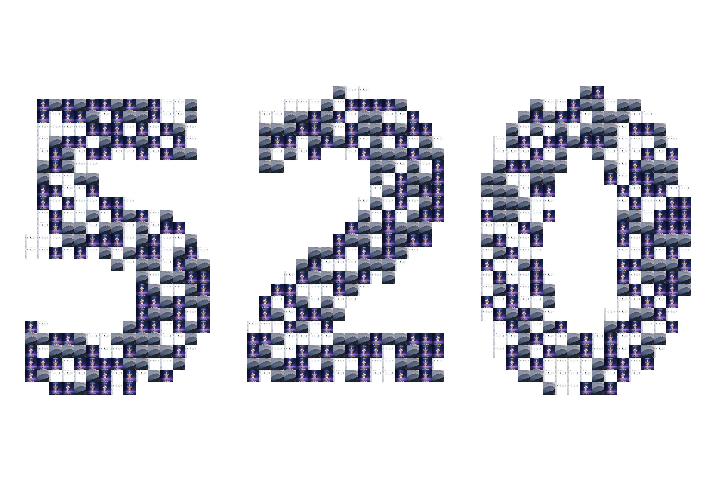

# 自制图片墙 表白文字生成器

## 项目简介
该项目**复现**了下面B站视频的代码。
这是一个用于在特殊场合，如情人节表白，通过多张合照生成一段浪漫文字的项目。通过该工具，你可以选择一系列的照片，然后生成一段表白文字，让你的表白更加特别和独特。

## 如何使用
一键运行python文件

## 教程
[Watch the video](https://www.bilibili.com/video/BV1no4y1U7Bk/?share_source=copy_web&vd_source=a49a734fc25868cf63b256fe4c650076)
点击上方图片查看演示视频。

## 注意事项

请确保你的照片都是高质量的，以获得最佳的表白效果。

## 联系作者

如果你有任何问题或建议，欢迎联系作者
感谢使用表白文字生成器！
